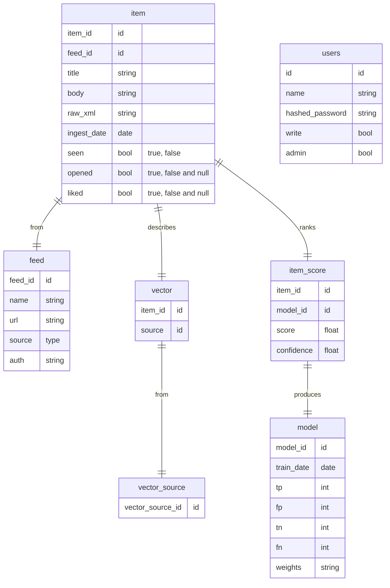

# Purrs

<!-- build status -->


Purrs is a web application that fetches RSS feeds from various sources, sorts and categorizes them, and displays them in a user-friendly web UI.

> **Note:** Purrs is currently in alpha. It may contain bugs and potentially lack some features. Your patience and feedback are appreciated as we improve the software.

## Motivation

The internet is a vast landscape filled with content from numerous sources. This diversity can be overwhelming, often making it difficult to keep track of the topics and updates that matter most to us. We end up spending precious time sifting through repeated or irrelevant information, or worse, missing out on important content.

Purrs aims to solve this problem. It's a tool designed to bring together RSS feeds from your chosen internet sources into one consolidated view, eliminating the hassle of visiting multiple sites or platforms.

However, we understand that not every post from a source is equally interesting to you. That's why Purrs leverages Machine Learning techniques to sort through these posts, highlighting the ones that align best with your interests.

In essence, Purrs is about optimizing your online content consumption by ensuring you see the content you care about, and not the content you've already read or don't find interesting.

## Features

- Ingests data from multiple RSS feed sources
- Makes feed items viewable in a Web UI
- Sorts and categorizes feed items using machine learning
- Enables liking/disliking to train model over time

## Documentation

Documentation for the modules can be found as markdown files in the [purrs/docs](./docs/index.md) folder.

## Building the Docker Image

To build the Docker image, run the following command:

```bash
docker build -t purrs .
```

## TODO (roughly in order)

 - [x] setup build pipeline
 - [x] ingest data from > 1 subreddit
 - [x] setup db schema
 - [x] save data into sqlite
 - [x] deduplicate data by URL
 - [x] web ui display text and image items
 - [x] save and load feeds from DB
 - [x] flask route for reading feed
 - [x] page for viewing existing feeds
 - [x] flask route for removing feed
 - [x] page button for deleting feeds
 - [ ] only ead feeds if they haven't been recently
 - [ ] automatic feed type detection (reddit url -> RedditFeed class)
 - [ ] RedditFeed cleans up image selection & description
 - [ ] Authentication
 - [ ] web ui like/dislike buttons write to db
 - [ ] make MD representations of items
 - [ ] embed all test representations and save to db
 - [ ] model training?
 - [ ] video previews
 - [ ] release (once I find myself getting distracted by the feed and not it's bugs/missing features)
 


## System Design
<!-- non-mvp material commented out -->


