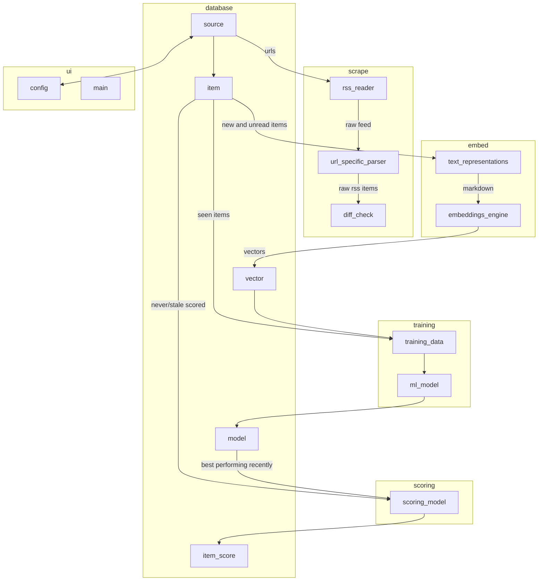
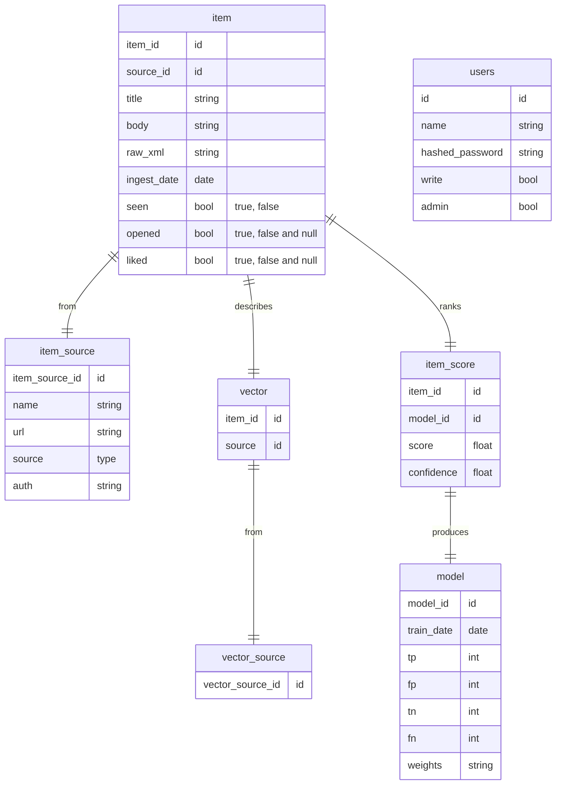

# Purrs

Purrs fetches the RSS feeds from various sources, sorts and categorizes them, and makes them viewable in a web ui.

## Building the Docker image

To build the Docker image, run:s.

```bash
docker build -t purrs .
```

## TODO (roughly in order)

1. ingest data from > 1 subreddit
1. setup db schema
1. save data into sqlite
1. basic deduplicate data
1. web ui display text items
1. web ui like/dislike buttons write to db
1. web ui shows more item types
1. make MD representations of items
1. embed all test representations and save to db
1. model training?
1. expand this todo list


<!-- non-mvp material commented out -->



